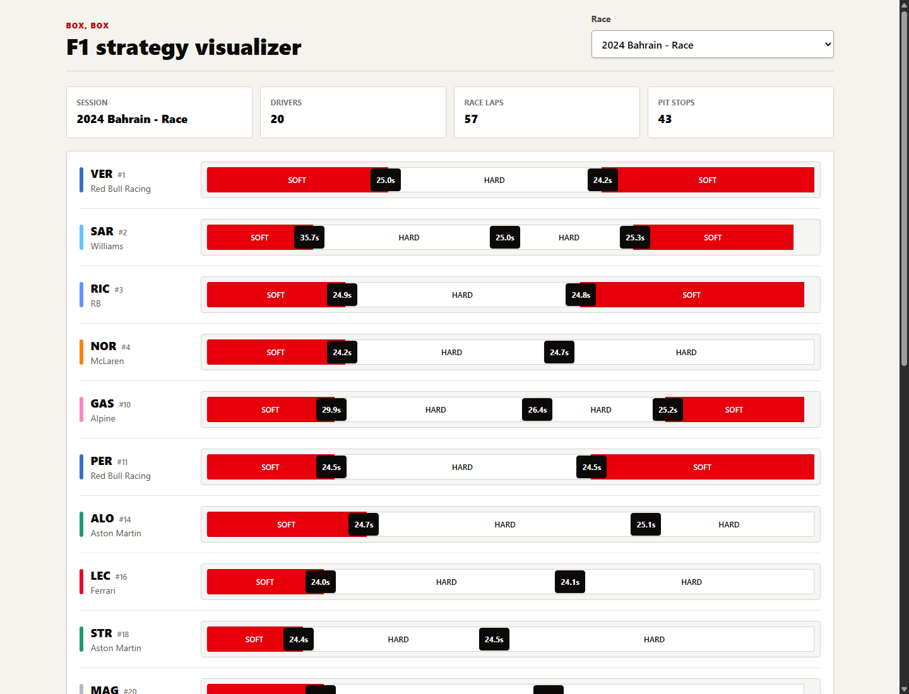

# Box, Box

Box, Box is a side-project Formula 1 pit strategy visualizer. It uses the public OpenF1 API to fetch race stint, pit stop, lap, and driver data, then renders each driver's tire strategy as a horizontal timeline.

The app is intentionally small: TypeScript backend, TypeScript React frontend, no database, and file-based caching for OpenF1 responses transformed by session.

[Live demo](https://mattbred.github.io/BoxBox/)



## Stack

- Backend: Node.js, Express, TypeScript
- Frontend: React, Vite, Tailwind CSS, TypeScript
- Data: OpenF1 public API
- Local deployment: Docker Compose

## Quick Start

Run both services with Docker:

```bash
docker compose up --build
```

Then open:

```text
http://localhost:5173
```

On narrow screens, each driver's timeline scrolls horizontally inside its row so the stint proportions and pit markers remain readable.

The backend is exposed at:

```text
http://localhost:3001
```

Compose runs both services in development mode. Source files are bind-mounted into the containers, so frontend changes should hot-reload without rebuilding the image. If you change dependencies or Dockerfiles, rerun:

```bash
docker compose up --build
```

## Live Demo

Open the live demo:

```text
https://mattbred.github.io/BoxBox/
```

The GitHub Pages deployment runs as a static demo using committed JSON for the 2026 Austria Race. It does not need the backend server at runtime. GitHub READMEs cannot embed the live app directly because scripts and iframes are stripped, so the README links to the hosted app and shows a screenshot instead.

The workflow in `.github/workflows/pages.yml` publishes the frontend on pushes to `master`.

## Local Development

Install backend dependencies:

```bash
cd backend
npm install
npm run dev
```

Install frontend dependencies in another terminal:

```bash
cd frontend
npm install
npm run dev
```

The Vite dev server proxies `/api` and `/health` to the backend.

## Useful Commands

Backend:

```bash
cd backend
npm run typecheck
npm run poc:openf1
npm start
```

Frontend:

```bash
cd frontend
npm run typecheck
npm run lint
npm run build
npm run build:pages
```

## Data Flow

For a selected race session, the backend calls OpenF1 endpoints in bulk:

- `/sessions` to find or describe the race session
- `/drivers` for driver names, codes, and team colors
- `/stints` for tire compound usage by lap range
- `/pit` for pit stop lap and duration
- `/laps` for lap durations used to calculate stint averages

The backend transforms those records into one frontend-friendly strategy payload grouped by driver.

## File Cache

Transformed strategy payloads are cached by session key:

```text
backend/cache/{session_key}.json
```

On a cache hit, the backend returns the local file. On a cache miss, it fetches from OpenF1, transforms the data, writes the cache file, and returns the payload.

Docker Compose stores this cache in a named volume:

```text
backend-cache
```

## API Endpoints

```text
GET /health
GET /api/sessions?year=2026&session_name=Race
GET /api/strategy/:sessionKey
```

Known smoke-test session:

```text
2026 Austria Race
session_key: 11315
```

Example:

```bash
curl http://localhost:3001/api/strategy/11315
```

## Manual QA

- Start the app with `docker compose up --build`.
- Open `http://localhost:5173`.
- Confirm the race dropdown loads.
- Confirm the dashboard renders 2026 Austria Race strategy rows.
- Confirm compound colors appear for soft, hard, and any other available compounds.
- Confirm pit stop duration markers appear on the timelines.
- Hover a stint and confirm lap range, compound, and average lap time are shown.
- Refresh the page and confirm cached strategy data still loads.
